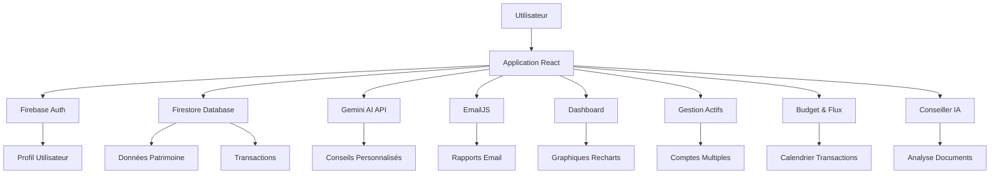

# Analyse du Projet MyWealth

## 📊 Résumé du Projet

**MyWealth** est une application web de gestion de patrimoine financier développée avec React et Firebase. L'application permet aux utilisateurs de suivre leurs actifs financiers, gérer leurs dépenses/revenus, et obtenir des conseils personnalisés via une IA intégrée (Gemini API).

### 🏗️ Architecture Technique

```
Frontend (React + Vite)
├── Composants principaux
│   ├── DashboardView (Tableau de bord)
│   ├── AssetsView (Gestion des actifs)
│   ├── BudgetView (Budget & Flux)
│   └── AiAdvisorView (Conseiller IA)
├── Authentification (Firebase Auth)
├── Base de données (Firestore)
└── API externe (Gemini AI)
```

### 📁 Structure des Fichiers

```
MyWealth/
├── public/                    # Assets statiques
├── src/
│   ├── App.jsx               (4,781 lignes - Composant principal)
│   ├── main.jsx              (Point d'entrée React)
│   └── index.css             (Styles Tailwind + custom)
├── Configuration
│   ├── package.json          (Dépendances React, Firebase, Recharts, etc.)
│   ├── vite.config.js        (Configuration Vite)
│   ├── tailwind.config.js    (Configuration Tailwind)
│   ├── firebase.json         (Configuration Firebase Hosting)
│   └── .firebaserc           (Cibles de déploiement)
└── Documentation
    └── README.md             (Template React + Vite)
```

### 🚀 Fonctionnalités Principales

1. **Gestion de Patrimoine**
   - Suivi multi-catégories (liquidités, investissements, immobilier, crypto, etc.)
   - Graphiques interactifs (Recharts)
   - Historique temporel des actifs
   - Comptes composites avec poches espèces

2. **Budget & Flux Financiers**
   - Suivi des revenus/dépenses
   - Calendrier des transactions
   - Catégorisation automatique
   - Graphiques de flux de trésorerie

3. **Conseiller IA Intégré**
   - Analyse de patrimoine avec Gemini API
   - Saisie vocale/naturelle des transactions
   - Analyse de documents (PDF/images)
   - Conseils personnalisés

4. **Système d'Authentification**
   - Connexion anonyme
   - Authentification email/mot de passe
   - Connexion Google
   - Profil utilisateur personnalisé

5. **Tutoriel Interactif**
   - Guide pas-à-pas (react-joyride)
   - Onboarding contextuel
   - Sauvegarde de progression

6. **Synchronisation Cloud**
   - Données persistantes avec Firestore
   - Sauvegarde/restauration
   - Rapports mensuels par email

### 🛠️ Stack Technique

- **Frontend**: React 19.2.0, Vite 7.2.4
- **Styling**: Tailwind CSS 3.4.17
- **Graphiques**: Recharts 3.5.1
- **Authentification**: Firebase 12.6.0
- **Base de données**: Firestore
- **IA**: Google Gemini API
- **Email**: EmailJS
- **UI Components**: Lucide React Icons
- **Tutoriel**: React Joyride

### 🔐 Configuration Sécurité

**Points d'attention :**
- Clés API exposées dans le code source (`apiKey` Gemini et EmailJS)
- Configuration Firebase publique
- Aucune variable d'environnement pour les secrets

## 💡 Idées d'Amélioration

### 🏆 Priorité Haute

1. **Sécurisation des Clés API**
   - Déplacer les clés dans des variables d'environnement
   - Implémenter un proxy backend pour les appels API sensibles
   - Utiliser Firebase Functions pour les appels Gemini

2. **Performance du Bundle**
   - Lazy loading des composants lourds (AiAdvisorView, etc.)
   - Code splitting avec Vite
   - Optimisation des imports (lucide-react)

3. **Expérience Mobile**
   - Améliorer la réactivité sur petits écrans
   - Gestures pour les interactions tactiles
   - PWA avec service workers

4. **Tests Automatisés**
   - Tests unitaires (Vitest/Jest)
   - Tests d'intégration (Cypress)
   - Tests de performance Lighthouse

### 🎯 Priorité Moyenne

5. **Accessibilité (WCAG)**
   - Ajouter ARIA labels
   - Support clavier complet
   - Contraste des couleurs
   - Screen reader compatibility

6. **Internationalisation**
   - Support multi-langues (i18next)
   - Formatage des devises locales
   - Dates localisées

7. **Export de Données**
   - Export PDF des rapports
   - Export CSV pour tableurs
   - Synchronisation avec API bancaires (open banking)

8. **Notifications en Temps Réel**
   - WebSocket pour mises à jour live
   - Notifications push
   - Alertes de seuil

### 🔧 Priorité Basse

9. **Analytics & Monitoring**
   - Google Analytics 4
   - Sentry pour erreurs
   - Performance monitoring

10. **Thèmes Personnalisables**
    - Mode sombre/clair
    - Palettes de couleurs personnalisables
    - Préférences utilisateur

11. **Collaboration**
    - Partage de portefeuilles
    - Conseils familiaux
    - Rôles et permissions

12. **Documentation**
    - Storybook pour les composants
    - Documentation technique
    - Guide utilisateur interactif

## 📈 Diagramme d'Architecture



## 🎯 Prochaines Étapes Recommandées

1. **Sécurisation immédiate** : Migrer les clés API vers des variables d'environnement
2. **Optimisation performance** : Implémenter le lazy loading des routes
3. **Tests** : Ajouter une suite de tests de base
4. **Documentation** : Créer un README détaillé du projet
5. **CI/CD** : Configurer GitHub Actions pour le déploiement automatique

## 📊 Métriques Clés à Surveiller

- Taille du bundle JavaScript
- Temps de chargement initial
- Score Lighthouse
- Taux de rétention utilisateur
- Performance des appels API
- Utilisation mémoire

---

*Analyse réalisée le 28/03/2026 - Projet MyWealth*